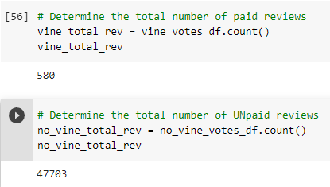
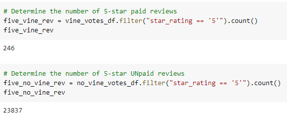
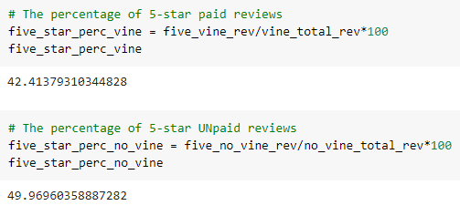

# Amazon_Vine_Analysis

## **Overview of the analysis**

This project is created to analyze Amazon reviews written by members of the paid Amazon Vine program. The Amazon Vine program is a service that allows manufacturers and publishers to receive reviews for their products. Companies like SellBy pay a small fee to Amazon and provide products to Amazon Vine members, who are then required to publish a review.

## **Results**

- How many Vine reviews and non-Vine reviews were there?

  

  There are 580 Vine reviews and 47703 non-Vine reviews

- How many Vine reviews were 5 stars? How many non-Vine reviews were 5 stars?

  

  5 stars Vine reviews: 246

  5 stars non-Vine reviews: 23837

- What percentage of Vine reviews were 5 stars? What percentage of non-Vine reviews were 5 stars?

  

  About 42.4% of Vine reviews were 5-stars.

  About 50% of non-Vine reviews were 5-stars.

## **Summary**

The analysis based on cameras reviews data shows that there is no positivity bias for reviews in Vine program. About 42.2% of 5-stars reviews are given in the Vine program compared to roughly 50% of 5-stars reviews got from non-Vine users. 

We can also analyze 2-stars reviews and find if there is any negativity bias for reviews in the Vine Program.